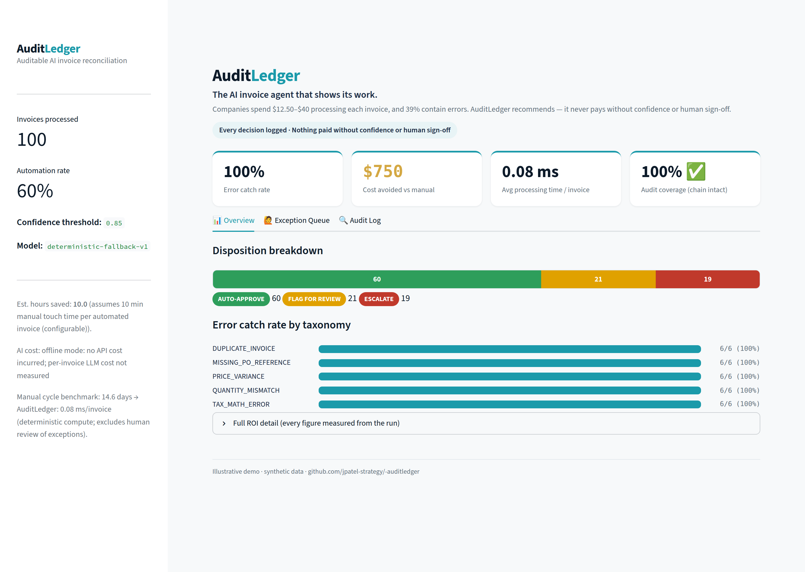

# 🧾 AuditLedger

**An auditable AI invoice-reconciliation agent — the LLM recommends, deterministic math decides, and every decision is logged immutably.**

AuditLedger processes accounts-payable invoices through a three-way match
(Invoice ↔ Purchase Order ↔ Goods Receipt), routes exceptions to a human, and
records every step in a tamper-evident audit log. The AI never has authority over
money; it only classifies and explains what a deterministic control has already
proven.



<sub>Executive dashboard (synthetic 100-invoice run). More views:
[exception queue](docs/img/exception-queue.png) ·
[audit-log browser](docs/img/audit-log.png) ·
[case study](docs/img/case-study.png).</sub>

---

## The financial thesis

Manual AP processing costs **$12.50–$40 per invoice**, takes **14.6 days** on
average, and **39% of invoices contain errors**. AI promises relief — but
finance teams can't hand company money to a black box that can't explain itself.

**AuditLedger's moat is auditability, not autonomy.** Three principles:

1. **The math is deterministic.** A classic 3-way match written in plain Python
   catches discrepancies. No LLM ever performs the reconciliation arithmetic.
2. **The LLM only recommends.** It proposes `AUTO-APPROVE` / `FLAG FOR REVIEW` /
   `ESCALATE` with a confidence score and a reasoning paragraph — but a hard
   guardrail forbids auto-approving anything the matcher flagged, and a second
   **Critic** agent checks the first agent's reasoning for consistency.
3. **Every decision is immutable.** An append-only, hash-chained audit log makes
   any decision fully explainable — and any tampering detectable — after the fact.

---

## Architecture

```
                         ┌──────────────────────────────────────────┐
   Raw invoice text ───▶ │  EXTRACTION                              │
   (PDF/email-like)      │  LLM (Anthropic Haiku) or offline parser │
                         └───────────────────┬──────────────────────┘
                                             │ structured invoice
                                             ▼
   PO + Goods Receipt ─▶ ┌──────────────────────────────────────────┐
                         │  DETERMINISTIC 3-WAY MATCH  (pure Python) │
                         │  duplicate · price · quantity · PO · tax  │
                         └───────────────────┬──────────────────────┘
                                             │ typed discrepancies
                          ┌──────────────────┴───────────────────┐
                          ▼                                       ▼
             ┌────────────────────────┐              ┌────────────────────────┐
             │  PRIMARY AGENT         │              │  VENDOR RISK PROFILES  │
             │  classify + confidence │◀─────────────│  historical error rate │
             │  + reasoning (guarded) │              └────────────────────────┘
             └───────────┬────────────┘
                         ▼
             ┌────────────────────────┐   validates (never overrides)
             │  CRITIC AGENT          │
             │  consistency check     │
             └───────────┬────────────┘
                         ▼
   ┌─────────────────────────────────────────────────────────────────────────┐
   │  IMMUTABLE AUDITOR LAYER  (SQLite)                                        │
   │  append-only + hash-chained audit_log · exception_queue · analytics/ROI  │
   └───────────────────────────────┬─────────────────────────────────────────┘
                                    ▼
                       ┌────────────────────────┐
                       │  STREAMLIT DASHBOARD    │  metrics · queue · log browser
                       └────────────────────────┘
```

---

## Quickstart

A fresh clone reaches a live dashboard in two commands:

```bash
pip install -r requirements.txt
streamlit run app.py
```

The first launch **builds the database, executes the agent loop, and populates
the dashboard** automatically. No API key is required — offline, the pipeline
uses a deterministic extractor and reasoning template so the whole system runs
and every metric is reproducible.

**To use the live LLM** (Anthropic Haiku) for extraction and reasoning, copy
`.env.example` to `.env` and set `ANTHROPIC_API_KEY`. The key is git-ignored and
never committed; the deterministic matcher — the part that actually catches
errors — is unchanged either way.

**Command-line run** (build + process + print the audit summary):

```bash
python scripts/run_pipeline.py
```

---

## ROI statistics (measured on the 100-invoice synthetic set)

Every number below comes from an actual run against the hidden ground-truth
table — none are estimated except where explicitly labeled.

| Metric | Result |
|---|---|
| Invoices processed | 100 (15 vendors, 30 seeded defects) |
| **Error catch rate** | **100%** — all 5 taxonomy types, 6/6 each |
| Seeded errors auto-approved | **0** (the guardrail holds) |
| Auto-approved / Flagged / Escalated | 60 / 21 / 19 |
| Automation rate | 60% |
| Manual baseline cost | $1,250 (100 × $12.50, conservative low end) |
| **Cost avoided** | **$750** (60 automated × $12.50) |
| Estimated hours saved | 10.0 *(assumes 10 min/invoice manual touch time — configurable)* |
| Avg processing time | sub-millisecond/invoice, deterministic compute (measured) vs the 14.6-day manual cycle |
| Audit chain integrity | INTACT |
| AI processing cost | $0 offline (not measured; honestly reported, never invented) |

---

## Case study — modeling AP risk at retail scale (illustrative)

> **Honesty frame:** this is a *demonstration modeled on publicly reported figures*,
> not consulting work. Every dollar below is either **measured** from the real
> synthetic run or an **illustrative projection** applying published industry
> benchmarks to openly-stated assumptions. Not affiliated with, endorsed by, or
> commissioned by the named company; no figure was identified in its actual books.

Modeled against **Walmart's** publicly reported AP scale (~5M invoices/yr, assumed):
a 100%-auditable control addressing an industry-benchmarked **$3.9B–$9.7B/yr in
duplicate-payment leakage** (published 0.8–2% of outgoing payments) and **~$37.5M in
manual processing cost** (measured 60% automation × the $12.50 benchmark) — every
dollar traceable to a logged decision.

- **Interactive:** the *Case Study* tab in the dashboard.
- **One-pager:** [`docs/case_study.pdf`](docs/case_study.pdf) · [HTML](docs/case_study.html)
  (regenerate with `python scripts/build_case_study.py`).
- **Switch company / update to the latest 10-K:** edit `RETAILER` and `ASSUMPTIONS`
  in `src/auditledger/case_study.py` — nothing else changes.

Resume-safe phrasing: *"Modeled AuditLedger against a large retailer's publicly
reported AP scale, illustrating an addressable multi-billion-dollar duplicate-payment
leakage range with 100% decision auditability — using only synthetic data and public
figures."*

---

## How it's built (4 milestones)

1. **Synthetic data & deterministic matching core** — 100 reproducible
   Invoice/PO/Receipt triples, a 5-part seeded error taxonomy tagged in a hidden
   ground-truth table, vendor risk profiles, and the pure-Python 3-way matcher.
2. **Agentic evaluation loop** — LLM extraction, a Primary Agent (deterministic
   classification + confidence, LLM-phrased reasoning), and a Critic Agent that
   validates consistency without re-deciding.
3. **Immutable auditor layer** — append-only, hash-chained audit log; a human
   exception queue that records sign-off alongside the AI recommendation; and an
   analytics/ROI engine.
4. **Executive dashboard** — this Streamlit app.

Each milestone ships behind a passing verification gate.

---

## Auditor FAQ

**Q: Can the AI approve a payment on its own?**
No. The AI only recommends. A deterministic guardrail forbids `AUTO-APPROVE` for
any invoice carrying a discrepancy, and only clean invoices above the visible
confidence threshold (`config.CONFIDENCE_THRESHOLD`, default 0.85) are automated.
Everything else requires human sign-off.

**Q: How do I know a decision wasn't changed after the fact?**
The audit log is append-only (enforced by database triggers) and hash-chained —
each entry's hash depends on the previous one. `verify_chain()` recomputes the
whole chain; a single altered field breaks it. The dashboard shows chain status
live.

**Q: Can you explain any invoice without re-running the model?**
Yes. `service.explain_invoice()` reconstructs an invoice's full disposition —
AI recommendation, confidence, model version, input hash, human decision — from
the log alone. This is a tested guarantee.

**Q: What stops the LLM from hallucinating a wrong number?**
The LLM's extracted figures feed the deterministic matcher, which recomputes tax,
totals, prices, and quantities against the PO and receipt. If extraction is
unreliable, the invoice fails the match and is flagged — it is never silently
approved. Extraction failures fall back to the deterministic parser and are
recorded.

**Q: Where do the metrics come from?**
Every figure is queried from the persisted audit log and ground-truth table. The
one estimated metric (hours saved) is explicitly labeled with its assumption.

---

## Limitations (v1, honest scope)

- **Synthetic data.** All invoices, POs, and receipts are generated from a fixed
  seed. Results demonstrate the *controls*, not real-world extraction accuracy.
- **Single currency / jurisdiction.** One tax rate (`DEFAULT_TAX_RATE`), USD only.
- **Offline by default.** Without an API key the LLM steps use deterministic
  fallbacks; live-model token cost is not yet metered.
- **Touch-time assumption.** "Hours saved" rests on a configurable 10-min/invoice
  assumption, not a measured study.
- **Frozen scope.** No ERP integration, multi-line PO tolerances beyond price %,
  or partial-shipment logic in v1.

---

## Testing

```bash
pytest -v
```

The suite is the project's spec. Key gates:

- **M1:** the matcher catches 100% of every seeded error type, zero false positives.
- **M2:** all 100 invoices run end-to-end with zero seeded errors reaching `AUTO-APPROVE`.
- **M3:** append-only enforcement, hash-chain tamper detection, human sign-off
  recording, and log-only explainability.
- **M4:** a from-scratch bootstrap builds the DB, runs the loop, and populates the
  analytics the dashboard reads. The Streamlit app is additionally smoke-tested
  headlessly via Streamlit's `AppTest`.

---

## Project structure

```
src/auditledger/
  config.py            all auditor-facing controls in one place
  money.py, taxonomy.py
  data/                synthetic engine, seeding, schema
  matching/            deterministic 3-way match
  agents/              extraction, Primary + Critic, pipeline
  db/                  SQLite schema, immutable audit log, exception queue
  analytics.py         ROI / catch-rate engine
  service.py           orchestration + explain_invoice + bootstrap
scripts/               build_db.py, run_pipeline.py
tests/                 the verification gates
app.py                 Streamlit executive dashboard
```

*AuditLedger is a portfolio demonstration built on synthetic data. It illustrates
an auditable pattern for AI in finance; it is not a production AP system.*
